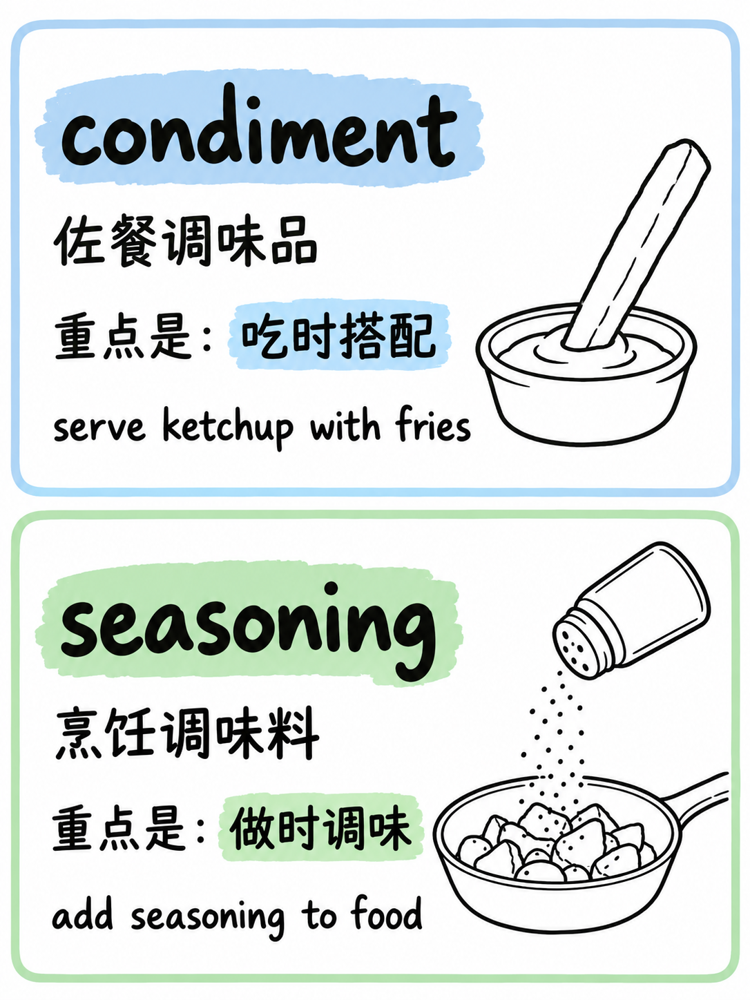

# Word Contrast Card Skill

An agent skill for comparing 2–10 similar or easily confused English words and turning their differences into a consistent series of illustrated vocabulary cards.

The skill analyzes the complete word set before grouping it, locks every piece of text before image generation, and checks the finished cards for text and visual consistency. Each card contains two or three words and uses the default 3:4 portrait layout.

## Use

For Codex, place this repository folder at either `~/.codex/skills/word-contrast-card/` for your user account or `.codex/skills/word-contrast-card/` inside a project. The folder should directly contain `SKILL.md`; keep `assets/` beside it. Other skill-capable hosts may use a different skills directory. See the [OpenAI Skills documentation](https://developers.openai.com/plugins/concepts/skills) for the skill folder format.

Then ask for cards from two to ten words, for example:

```text
Compare company, firm, business, corporation, enterprise, and organization.
```

The default `full` mode includes the semantic map, grouping, locked text, image prompts, and generated cards. Ask for `compact` mode to see only the core contrasts and images. Image generation requires the host to provide an image-generation tool.

## Example

The [condiment / seasoning example](examples/condiment-seasoning.md) includes the semantic analysis, image prompt, text lock list, generated card, and visual check.



## Repository files

- `SKILL.md` — workflow and output requirements
- `assets/semantic-template.md` — semantic analysis format
- `assets/image-template.md` — card image prompt template
- `examples/` — a complete example and its generated image
- `CHANGELOG.md` — skill changes by version

## 中文简介

这是一个用于英语近义词和易混词辨析的 Agent Skill。输入 2–10 个单词后，它会先统一分析词义，再按每张 2–3 个词分组，锁定图片文字，生成并检查 3:4 手绘单词卡。完整示例见 [`examples/condiment-seasoning.md`](examples/condiment-seasoning.md)。

## License

CC BY-NC 4.0.
